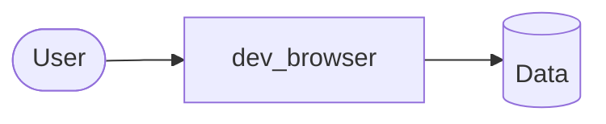

Diagrams are written as Mermaid blocks and drawn in the browser, in light or dark to match the theme.

```mermaid
flowchart LR
  user([User]) --> app[dev_browser]
  app --> store[(Data)]
```

Replace this with the real components, and add sequence diagrams for the flows that matter.
